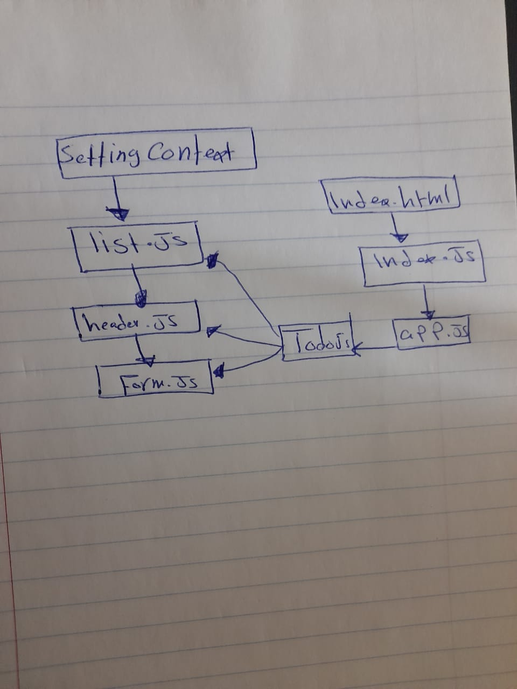

# todo-app

 an application designed for creating and organizing a “To Do” list in your browser.

### Technical Requirements :
  * The application will be created with the following overall architecture and methodologies

     1. React
     2. ES6 Classes
     3. Settings delivered to the application using Context
     4. User Login & Permissions delivered to the application using Context
     5. Local Storage / Cookies for storing login status
     6. React Bootstrap for styling

